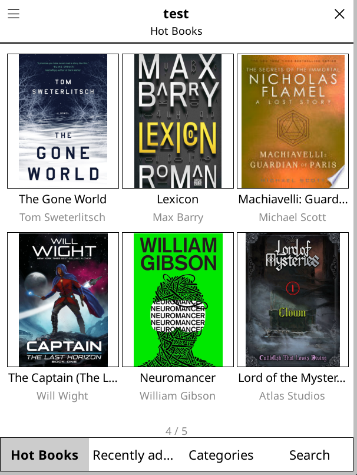

# simple-opds.koplugin

A clean, grid-first OPDS browser plugin for KOReader. Adding a server opens directly into a cover grid; a persistent bottom bar switches between Home / Recent / Genre / Search. Covers and titles are cached on device.

## Install

Symlink the plugin into your KOReader plugins directory:

```
ln -s "$(pwd)/simple-opds.koplugin" /path/to/koreader/plugins/simple-opds.koplugin
```

For the local emulator at `/home/broemp/kindle/`:

```
ln -s "$(pwd)/simple-opds.koplugin" /home/broemp/kindle/ko-home/plugins/simple-opds.koplugin
```

Then open KOReader and enable **Simple OPDS** under the FileManager top menu.

## Screenshots


